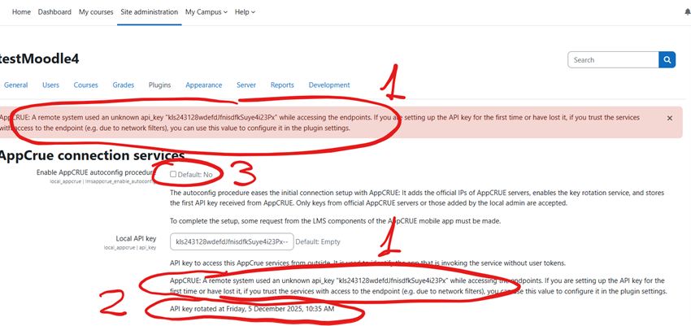

# AppCRUE services

Implements services to give access to AppCRUE to different types of information about a user identified by a token or an API key.

The token must be validated and authenticated by a configurable external identity provider (IdP).

This plugin was developed to enable Moodle to publish information for the AppCRUE application.

# Functionality

This plugin implements a set of simple REST endpoints that provide a backend with calendar events, forum posts, files, grades, and announcements accessible by a particular user.
It authenticates the caller, identifies the queried user, impersonates that user and queries Moodle internal APIs.
It implements endpoints compatible with the classical AppCRUE API (calendar events, autologin, sitemap generation, avatar retrieval) and web services to send notifications from external systems.

## LMS integration APIs

This plugin implements a set of REST endpoints to provide information for a specific user. They accept an API key to authorize the AppCRUE backend, a user identifier (for example, email), then match the identifier against user fields, impersonate the user, and query Moodle internal APIs.

- local/appcrue/appcrue.php/calendar: provides calendar events for a user. Parameters: apikey, userid, timestart, timeend.
- local/appcrue/appcrue.php/forums: provides forum posts for a user. Parameters: apikey, userid, optional timestart.
- local/appcrue/appcrue.php/files: provides files downloadable by a user. Parameters: apikey, userid.
- local/appcrue/appcrue.php/grades: provides grades for a user. Parameters: apikey, userid.
- local/appcrue/appcrue.php/announcements: provides announcements for a user (news forums). Parameters: apikey, userid.
- local/appcrue/appcrue.php/rotatekey: rotates the API key used by AppCRUE to call the LMS APIs. Parameters: apikey (current), newapikey.

This local plugin provides the following services following the AppCRUE API:

- usercalendar: reports calendar events for a user. It accepts the parameters fromDate, toDate, token.

Example response:
```json
{
  "calendar": [
    {
      "date": "2020-04-21",
      "events": [
        {
          "id": 1033992237,
          "title": "Tutoring",
          "description": "Tutoring in Mathematics",
          "url": "http://universidad.es/tuperfil/tutorias",
          "nameAuthor": "Autor",
          "imgDetail": "http://test.host/uploads/event/logo/1033992237/example.png",
          "type": "TUTORIA",
          "startsAt": "1575990139",
          "endsAt": "1575990139"
        },
        {
          "id": 1033992247,
          "title": "Clase",
          "description": "Clase asignatura Inglés",
          "url": "http://universidad.es/tuperfil/tutorias",
          "nameAuthor": "Autor",
          "imgDetail": "http://test.host/uploads/event/logo/1033992237/example.png",
          "type": "HORARIO",
          "startsAt": "1575990139",
          "endsAt": "1575990139"
        }
      ]
    },
    {
      "date": "2020-04-22",
      "events": [
        {
          "id": 1033945237,
          "title": "Tutoria",
          "description": "Tutoria asignatura Matemáticas",
          "url": "http://universidad.es/tuperfil/tutorias",
          "nameAuthor": "Autor",
          "imgDetail": "http://test.host/uploads/event/logo/1033992237/example.png",
          "type": "TUTORIA",
          "startsAt": "157593453",
          "endsAt": "157593453"
        },
        {
          "id": 1033992449,
          "title": "Clase",
          "description": "Clase asignatura Inglés",
          "url": "http://universidad.es/tuperfil/tutorias",
          "nameAuthor": "Autor",
          "imgDetail": "http://test.host/uploads/event/logo/1033992237/example.png",
          "type": "HORARIO",
          "startsAt": "157593453",
          "endsAt": "157593453"
        }
      ]
    }
  ]
}
```

## Utility endpoints

These endpoints simplify integration with the AppCRUE mobile app and make navigation from the mobile device to Moodle easier. Most endpoints can also be reused for URL redirection, course dereferencing, and other purposes.

- autologin: logs in a user with an external token and redirects them to a deep link. It can also build redirect URLs from a library of configured URL patterns and parameters. Parameters: token, fallback, urltogo, course, group, pattern, param1, param2, param3.
  - token: auth token.
  - pattern: if specified, parameters are used to generate the URL by replacing placeholders in a registered pattern.
  - fallback: response when token is absent or invalid. Values: "ignore", "error", "logout".
  - urltogo: deep link relative to the Moodle site to visit after token validation.
  - course, group, param1, param2, param3: general-purpose parameters for pattern-based URL generation or course lookup (see local_appcrue/pattern_lib and local_appcrue/course_pattern settings).

- sitemap: generates a JSON representation of categories and courses. Parameters: token, category, includecourses, hiddencats, urlsonlyonends.
  - token: auth token.
  - includecourses: whether to include courses (do not stop at category level).
  - hiddencats: omit a list of categories from the sitemap using PHP array form parameters. Example: hiddencats[0]=2&hiddencats[1]=34.
  - urlsonlyonends: if true, only the last element of each branch has a URL; otherwise every node has a URL.

Example sitemap:
```json
{
  "navegable": [
    {
      "name": "Miscellaneous",
      "description": "A bit of everything",
      "id": "1",
      "navegable": [
        {
          "name": "Ingenier\u00eda",
          "description": "<p dir=\"ltr\" style=\"text-align: left;\">Categoria xxxxxxxxxxxxxxxxxxxxxxxxxxxxxxxxxxxxx</p>",
          "id": "3",
          "url": "https://XXXXX/moodle310/course/index.php?categoryid=3"
        }
      ]
    },
    {
      "name": "empty",
      "description": "<p>&nbsp;vccc</p>",
      "id": "2",
      "url": "https://XXXXX/moodle310/course/index.php?categoryid=2"
    }
  ]
}
```

- avatar: identifies a user with an external token and returns their avatar image in raw or base64 format.
- notifygrades web service: receives a webhook from an external academic management system, composes a localized message with the grade and other details, and sends it via the messaging API (may be routed to AppCRUE as well). Works with message_appcrue push notification plugin to deliver messages to AppCRUE.
- send_instant_message web service: sends a private message to a user via the messaging API. Works with message_appcrue push notification plugin to deliver messages to AppCRUE.


## Web services

This plugin provides web services to perform actions from external systems:

- notifygrades: receives a webhook from an external academic management system, composes a localized message with the grade and other details, and sends it via the messaging API.
- send_instant_message: sends a private message to a user via the messaging API.

Activate the web services following the instructions at:
https://[SERVER]/admin/settings.php?section=webservicesoverview

## Configuration

After installing the `local_appcrue` plugin, configure it at:

Site administration → Plugins → Local plugins → AppCrue Connection Services
or: `https://[YOUR_MOODLE_SITE]/admin/settings.php?section=local_appcrue`
Each setting has a help icon with more information.

General settings
- Autoconfig mode: enable to let AppCRUE configure the plugin automatically on first API call.
- API Key: shared secret used by AppCRUE backend to call LMS API endpoints.
- API key rotation: enable if AppCRUE should be allowed to rotate the API key.
- Authorized networks: list of IP addresses / CIDR ranges (one per line) allowed to call the LMS API.
- Enable/disable per-service switches (calendar, forums, files, grades, announcements, sitemap, avatar, autologin, notifications, assignments).

LMS API (widget integration)
- Calendar
  - Enable unified calendar endpoint.
  - Options: include site events, course events, personal events.
  - Configure event types to mark as "EXAM" if applicable.
- Forums
  - Enable forum integration.
  - Configure a time window to limit returned posts.
  - local_mail support: optional toggle to treat local_mail folders as forums (requires `local_mail` plugin).
- Files
  - Enable files integration to expose downloadable files and links.
- Grades
  - Enable grades integration to expose user grade items.
- Announcements
  - Enable news/forum announcements endpoint.

Autologin
- Enable autologin endpoint (token-based). Need to have a IdP token-user resolver endpoint.
- Token mark: decide whether tokens arrive as URL parameter or bearer header.
- Fallback behavior on invalid/missing token: `ignore/continue`, `logout`, or `error`.
- Optional pattern library and course lookup SQL pattern to build deep links.

Sitemap
- Enable sitemap generation.
- Options: include courses, hide specified categories, urlsonlyonends toggle.
- Cache options: enable sitemap cache and set TTL.

Avatar
- Enable avatar endpoint.
- Mode: base64 or native binary.

Assignments
- Enable assignments integration.
- Provide activity mapping lines in the format:
  ```
  mod_activityname|table|startdatefield|enddatefield
  ```

Notify grade web service (notifygrades)
1. Enable web services in Moodle (Site administration → Advanced features / Web services).
2. Create a dedicated user and assign required capabilities.
3. Generate a token for that user and configure the external system to call:
   ```
   https://[YOUR_MOODLE_SITE]/webservice/rest/server.php
   wsfunction=local_appcrue_notify_grade
   wstoken=[ACCESS_TOKEN]
   moodlewsrestformat=json
   ```
4. Parameters: student id (or identifier), course, grade, gradealpha, revdate, comment, subject, subjectname, group, call, nip.

Token / IdP validation (for token-based endpoints)
- Configure IdP token endpoint URL and JSON selector (JSONPath) used to extract the user identifier.
- Configure which Moodle profile field holds the external identifier.
- Optionally set OAuth client id/secret and token endpoint if using an OAuth IdP.

Notes and examples
- To allow any network for API calls use `0.0.0.0/0`; leaving authorized networks empty blocks access.
- Example sitemap and calendar JSON responses are in this README (see above).
- Keep API Key confidential and, if possible, enable API key rotation.

For detailed step-by-step installation, git-based installation, and examples, see the rest of this README and the `LMS AppCrue Configuración` guide bundled with the plugin.

## Troubleshooting installation

### 1. LMS connection diagnosis
IMPORTANT: Before running any tests, make sure the latest versions of the local_appcrue and message_appcrue plugins are installed.
Be sure to have a valid user in Moodle with the same email as the AppCRUE user. The user must be enrolled in at least one course with content (assignments, messages, grades, etc.) to see data in the App.
Be sure to enable the services you want to expose in the plugin configuration page.

#### 1.1 Pre-diagnosis (from AppCRUE Backend side)
After registering an LMS in the backend, confirm that the microservices can reach the LMS endpoint.

Possible cause of failure: No connectivity between the microservices layer and the Moodle server.
- Check that the LMS URL configured in the backend includes the trailing "/". The microservices layer should handle this character, but path handling issues have been observed.
- If you receive 500, timeout, or similar errors, review the WAF and firewalls at the university.
- HTTP 400, 401, 403, and 404 responses are part of the API when no API key is supplied, the request payload is invalid, or the service is disabled.

#### 1.2 University: Connectivity available, automatic key setup
If there is connectivity between UNIVERSIA and the Moodle server but the keys are not configured, the plugin administration page should display diagnostic messages.



(1) Warning: No API key configured. Enable checkbox 3 to allow automatic key setup.
(2) Info: Last key renewal at [timestamp].

Checklist:
1) Do the warning messages (1) appear? Enable checkbox 3, save the configuration, trigger a request from the app, reload the browser, and confirm that message 1 disappears. Message 2 should display the timestamp of the latest action. If nothing changes, review the LMS URL and the IP filters defined in UNIVERSIA.
2) Do you see a timestamped key renewal message similar to (2)? If no message appears, review the LMS URL and the IP filters configured with UNIVERSIA.
3) If steps 1 and 2 are correct, review the activation status of the services you want to expose in each configuration section. Each API can be disabled individually and they ship disabled by default.

#### 1.3 University: No connectivity

Symptoms:
- App requests do not return LMS data.
- The administration page does not show any of the diagnostics listed above.

Diagnosis: There is no connectivity between UNIVERSIA and Moodle.

**Test 1: Server and plugin**
1) Leave the default IP list unchanged.
2) From any browser, load https://ServidorMoodle/local/appcrue/appcrue.php/forums
3) The response should be "403 Forbidden".
This confirms the plugin is installed and Moodle is serving requests.

**Test 2: local_appcrue plugin**
1) Add 10.0.0.1/0 (allow all IP addresses) to the allowed IP list.
2) Load https://ServidorMoodle/local/appcrue/appcrue.php/forums
3) Confirm you receive HTTP 400 with the following JSON payload:
```
{
  "success": false,
  "error": {
    "code": 2,
    "message": "Missing token and API key",
    "timestamp": 1770108919
  }
}
```
If this test succeeds, the plugin is operating correctly.

**Test 3: IP filtering**
1) Add 10.0.0.1/0 (allow all IP addresses) to the allowed IP list.
2) Load any LMS widget in the App.
3) Check whether the diagnostic messages described in section 1.2 appear.
If this test succeeds, the issue lies in the local Moodle installation. Possible causes:
- A firewall blocking outbound connections from Moodle (common on staging environments but not acceptable in production).
- A firewall or reverse proxy that does not include the X-FORWARDED-FOR header, preventing the API from determining the request origin and applying IP filtering.

**Test 4: User data**
LMS widgets will not display data (or will return errors) if the AppCRUE user is not present in the LMS.
Verify that a user with the same email as the AppCRUE profile exists in Moodle, is enrolled in a course, and has content to show (assignments, messages, grades, etc.).


## What is AppCRUE?

AppCRUE (https://tic.crue.org/app-crue/) is a mobile app developed by CRUE (Conference of Rectors of Spanish Universities) and Santander Bank. It is used by:

- +200 educational institutions public and private with 100% customizable apps in 7 countries
- 128 apps distributed in the app stores of Spain (Apple Store and Google Play)
- +3M registered users on the platform
- +500M page views in 2025
- +50M visits in 2025
- +60M push notifications sent in 2025
- +1M monthly users in the last 30 days
- +110 services available

## License

This program is free software: you can redistribute it and/or modify it under the terms of the GNU General Public License as published by the Free Software Foundation, either version 3 of the License, or (at your option) any later version.

This program is distributed in the hope that it will be useful, but WITHOUT ANY WARRANTY; without even the implied warranty of MERCHANTABILITY or FITNESS FOR A PARTICULAR PURPOSE. See the GNU General Public License for more details.

You should have received a copy of the GNU General Public License along with this program. If not, see <http://www.gnu.org/licenses/>.
