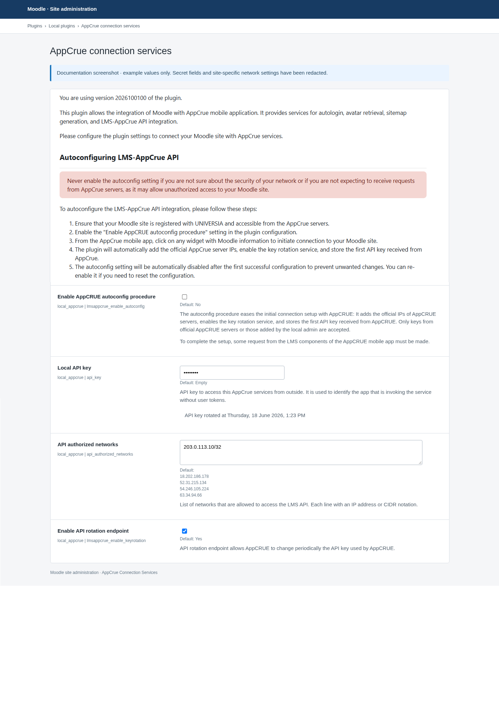
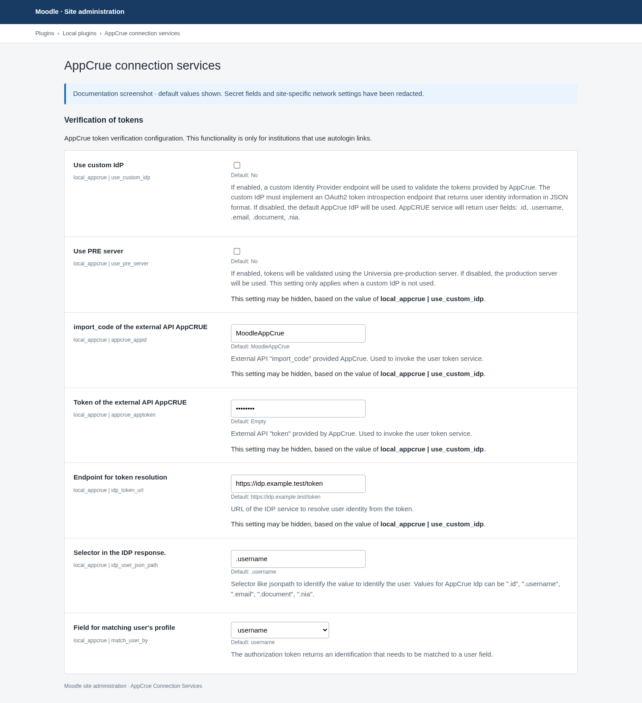
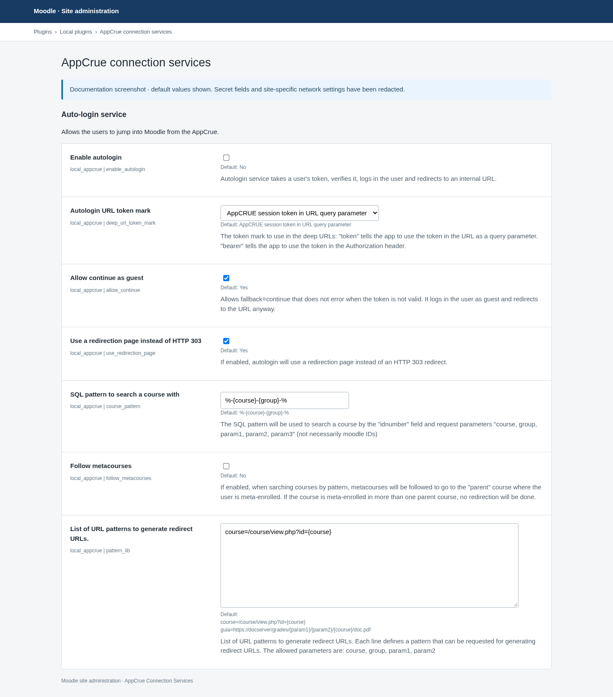
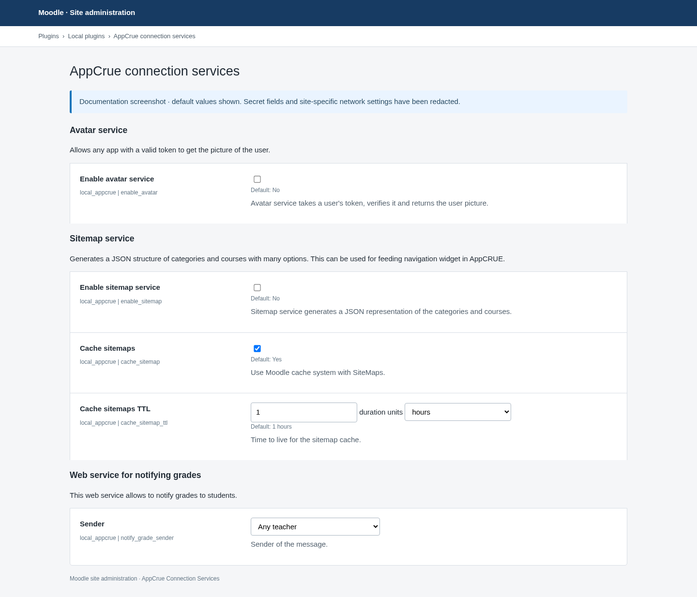
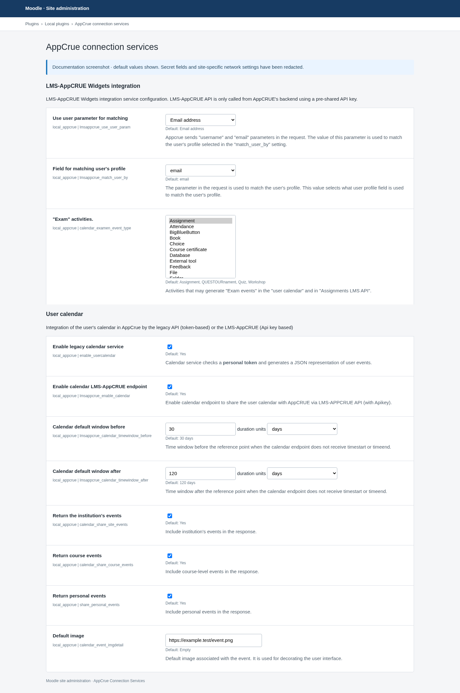
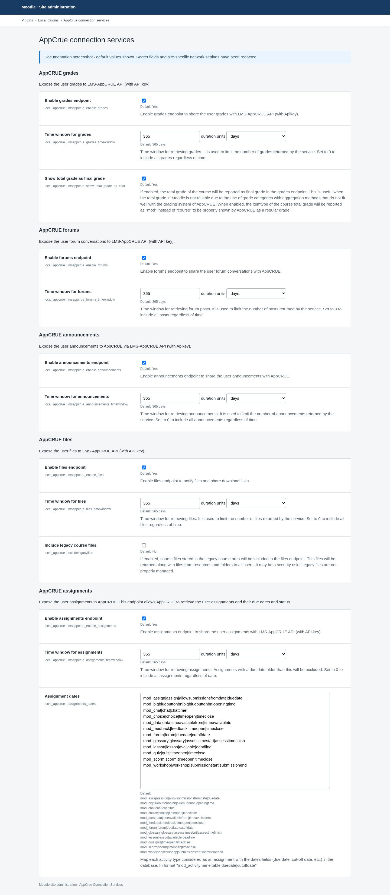

# AppCRUE services

This Moodle local plugin exposes user-specific LMS data to the AppCRUE mobile app and backend. It also provides token-based login, calendar, avatar and sitemap endpoints, plus Moodle web services for messages and grade notifications.

## Installation and troubleshooting

### Installation

1. Install this plugin in Moodle's `local/appcrue` directory, either from a release archive or a Git checkout.
2. Sign in as a site administrator and open **Site administration → Notifications** to complete the upgrade.
3. Open **Site administration → Plugins → Local plugins → AppCrue Connection Services**, or go directly to `/admin/settings.php?section=local_appcrue`.
4. Configure the API key, allowed source networks, user matching and the endpoints required by your AppCRUE integration. See [Settings](#settings) and [LMS integration APIs](#lms-integration-apis).
5. Configure the AppCRUE backend with the Moodle base URL and the API key through your approved secret-management process. Use HTTPS.

The plugin's endpoints rely on Moodle core libraries and require an installed Moodle version supported by the plugin release. When upgrading, follow Moodle's normal plugin upgrade process and review the release notes.

### First connection checklist

Before testing, confirm that:

- The AppCRUE backend can reach the Moodle site over HTTPS. Check DNS, TLS certificates, reverse proxies, WAF rules and firewalls if requests time out or return a server error.
- The calling AppCRUE server's source IP is included in **API authorized networks** for `/local/appcrue/appcrue.php/*` requests. Add only the required IP addresses or CIDR ranges; do not use a wildcard range as a diagnostic shortcut.
- The required LMS API endpoint is enabled.
- The AppCRUE user exists in Moodle and the configured request identifier matches the selected Moodle profile field. For data endpoints, the user also needs relevant course access and content.
- The request uses the configured identity parameter (`studentemail` or `username`) and a valid API key, preferably in the `X-API-KEY` header.

A request to `/local/appcrue/appcrue.php/forums` without credentials is a useful installation check when the caller is on an allowed network: it should reach Moodle and return a structured missing-credentials error. A `403` usually means the request did not pass the network check; a `404` may mean the endpoint is disabled or the route is unavailable. An authentication error indicates that the request reached the plugin but its credentials need attention. Exact HTTP status and error details can vary by endpoint and Moodle configuration.

### AppCRUE autoconfiguration

The **Enable AppCRUE autoconfig procedure** setting is intended for initial connection setup. On an eligible request from an accepted AppCRUE server, it can add the official AppCRUE source IP to the configured network list, save the first API key, enable API key rotation and then turn itself off. Review the resulting key and network list in settings. Keep the allowed network list limited to trusted backend addresses.

### Troubleshooting

| Symptom | Checks |
| --- | --- |
| Connection timeout or HTTP 5xx | Check Moodle availability, TLS, reverse proxy, WAF and inbound firewall rules. Confirm the AppCRUE backend is using the correct Moodle base URL and path. |
| HTTP 403 from `appcrue.php` | Check **API authorized networks** and the client address Moodle sees. If Moodle is behind a proxy, configure Moodle's trusted proxy settings so client addresses are reported correctly. |
| Missing/invalid API key | Confirm the current **Local API key**, use the `X-API-KEY` header, and check for whitespace or accidental URL encoding. API keys accept ASCII letters, digits, hyphens and underscores. Do not paste keys into tickets or logs. |
| User not found | Confirm `studentemail` or `username` is selected under **Use user parameter for matching**, then ensure **Field for matching user's profile** points to the Moodle field containing that value. Check casing and duplicate values. |
| Empty calendar, grades, files, forums, announcements or assignments | Enable the corresponding endpoint, check that the user can access courses with that content, and review the endpoint's time-window settings. A value of `0` disables the time cutoff for services whose setting documents that behavior. |
| Login fails or MFA appears | Check the IdP mode, token validation endpoint and user-field mapping. If Moodle MFA is enabled and AppCRUE autologin is enabled, the plugin adds its autologin path to Moodle MFA redirect exclusions; the settings page links to the relevant Moodle search. |
| Push notification test fails | Check the separate `message_appcrue` plugin, its push provider credentials and the target user's AppCRUE registration. This plugin's LMS data API key is not the push provider credential. |

For an IP-filtering test, add the test machine's *single known source IP* as a temporary `/32` (IPv4) or `/128` (IPv6) entry, test, and remove it afterward. Never use `0.0.0.0/0`, `::/0` or another all-address range to troubleshoot a production system. Avoid putting API keys in query strings because URLs may be retained in proxy, browser or application logs.

## LMS integration APIs

The AppCRUE backend calls the slash-argument endpoint `/local/appcrue/appcrue.php/{endpoint}`. Requests authenticate with an API key plus a user identifier, or with an identity-provider token whose validated response identifies the user. For API-key requests, the plugin resolves the user using the configured request parameter and Moodle profile field.

The `appcrue.php` controller checks the caller against **API authorized networks** before processing requests. Send the API key in the `X-API-KEY` HTTP header; the `apikey` query parameter remains supported for compatibility but can expose the secret in logs.

| Endpoint | Required user identifier with API key | Optional request parameters | Response |
| --- | --- | --- | --- |
| `/calendar` | `studentemail` or `username` | `timestart`, `timeend` (Unix timestamps) | Calendar events within the requested range or configured default window. |
| `/forums` | `studentemail` or `username` | `timestart` (Unix timestamp) | User-visible forum posts, grouped into discussion threads. |
| `/grades` | `studentemail` or `username` | `timestart` (Unix timestamp) | User grades, subject to the configured time window. |
| `/announcements` | `studentemail` or `username` | `timestart` (Unix timestamp) | User-visible announcements from course news forums. |
| `/files` | `studentemail` or `username` | `timestart` (Unix timestamp) | User-visible course files and download links. Legacy course files are optional. |
| `/assignments` | `studentemail` or `username` | `timestart` (Unix timestamp) | Supported activity assignments with due dates and status. |
| `/keyrotation` | None; API key only | `newapikey` | Replaces the current key. The route is exposed by **Enable API rotation endpoint**; initial autoconfiguration also enables the runtime rotation flag. |

Example request (using email matching):

```bash
curl --get 'https://moodle.example.edu/local/appcrue/appcrue.php/forums' \
  --data-urlencode 'studentemail=student@example.edu' \
  --header "X-API-KEY: ${APPCRUE_API_KEY}"
```

If **Use user parameter for matching** is set to `username`, send `username` instead of `studentemail`. The selected **Field for matching user's profile** determines which Moodle profile field is compared with that value. Store the API key in a secret manager or protected environment variable; do not commit it or include it in shared command history.

Other AppCRUE endpoints:

| Endpoint | Purpose and parameters | Authentication / network check |
| --- | --- | --- |
| `/local/appcrue/usercalendar.php` | Legacy calendar response. Accepts `lang` (required), `fromDate` and `toDate` (`YYYYMMDD`), and optional `category`. | User token or API key; does not use the `appcrue.php` network allowlist. |
| `/local/appcrue/avatar.php` | User picture; `mode=base64` (default) or `mode=raw`. | User token or API key; does not use the `appcrue.php` network allowlist. |
| `/local/appcrue/sitemap.php` | Course/category tree; accepts `category`, `courses`, `hidden[]` and `endurls`. | No API key required. Enable the sitemap setting and protect access at the network or Moodle deployment layer if needed. |
| `/local/appcrue/autologin.php` | Validates an identity-provider token and redirects to a Moodle deep link. Supports `fallback`, `urltogo`, `course`, `group`, `pattern` and `param1`–`param3`. | Identity-provider token in the configured token parameter or a Bearer header. `urltogo` is restricted to this Moodle site. |

The standalone `usercalendar.php` and `avatar.php` routes accept the shared API key for compatibility, but they do not apply the `/appcrue.php` source-network allowlist. Apply suitable access controls at the reverse proxy or firewall if these routes are exposed to untrusted networks.

## Moodle web services

The plugin registers the external service `external_notifications` (short name `external_notifications`). It is disabled by default and restricted to users explicitly linked by a Moodle administrator. Enable Moodle web services, enable this service, link a dedicated service user and issue that user a token. The user needs the `moodle/site:sendmessage` capability for the registered functions.

Registered functions:

- `local_appcrue_send_instant_message`
- `local_appcrue_send_instant_messages`
- `local_appcrue_notify_grade`

Call them through Moodle's REST endpoint, normally `/webservice/rest/server.php`, using Moodle's standard `wstoken`, `wsfunction` and `moodlewsrestformat=json` parameters. Use a dedicated, restricted account and keep its web-service token secret.

## Settings

Open **Site administration → Plugins → Local plugins → AppCrue Connection Services** or `/admin/settings.php?section=local_appcrue`. Moodle renders a help icon beside each setting. Screenshots below show the current settings controls with example values; secrets and site-specific addresses are redacted.

### Connection and API key



- **Enable AppCRUE autoconfig procedure**: initial setup flow described above.
- **Local API key**: shared secret for API-key requests. Use only ASCII letters, digits, hyphens and underscores.
- **API authorized networks**: source IP addresses or CIDR ranges allowed to call the LMS widget API through `appcrue.php`.
- **Enable API rotation endpoint**: exposes `/keyrotation`. The initial autoconfiguration flow enables the runtime rotation flag used by the key-rotation service.

### Identity provider and user matching



- **Use custom IdP**: use an institution's token-validation endpoint instead of the AppCRUE IdP.
- **Use PRE server**: when custom IdP is off, validate tokens against the Universia pre-production service instead of production.
- **AppCrue AppId / AppCrue API token**: AppCRUE IdP client credentials; keep the token secret.
- **IdP token endpoint URL** and **IdP user JSON path**: configure the custom token validation response and the JSON field containing the Moodle user identifier.
- **Field for matching user's profile**: Moodle user profile field used to find the account resolved by token validation.

### Autologin



- **Enable autologin**: enables token-based login and deep-link redirects.
- **Deep URL token mark**: selects the token marker used in generated deep links.
- **Allow continue**: controls whether a failed or missing token may continue as a guest when `fallback=continue` is requested.
- **Use redirection page**, **Course pattern**, **Follow metacourses** and **List of URL patterns**: control the redirect flow and course/pattern-based URL generation.
- When Moodle MFA is active, enabling autologin adds `/local/appcrue/autologin.php` to `tool_mfa | redir_exclusions`; disabling autologin removes that entry. The page displays an information notice linking to Moodle's `redir_exclusions` setting search.

### Other AppCRUE services



- **Avatar service** and **Sitemap service** enable the corresponding legacy endpoints.
- **Cache sitemap** and **Sitemap cache TTL** control sitemap caching.
- **Web service for notifying grades** selects the sender used for grade notifications.

### LMS widget APIs



- **Use user parameter for matching** selects whether AppCRUE identifies users by email or username.
- **Field for matching user's profile** selects the Moodle field that is matched against the incoming value.
- **Calendar**: enables the widget endpoint, sets the default time window before and after now, selects whether site, course and personal events are shared, and marks selected activity types as exams. The separate legacy user-calendar endpoint has its own enable setting.



- **Grades**, **Forums**, **Announcements**, **Files** and **Assignments**: enable each endpoint and set its time window. For these windows, `0` includes all items regardless of age.
- **Show total grade as final grade**: reports the course total as a final grade.
- **Include legacy course files**: includes files from Moodle's legacy course file area; enable only if those files are managed appropriately.
- **Assignments activity mapping**: one mapping per line in the format `mod_name|table|start-date-field|due-date-field`. The default mapping is shown in the settings page.

## Tests

Run the tests from the Moodle repository root (the directory containing
`composer.json`, `vendor/` and `phpunit.xml`). For example:

```bash
cd /var/www/moodle
```

### First-time setup

Install Moodle's development dependencies with `composer install`. Configure a
dedicated PHPUnit data directory and table prefix in Moodle's `config.php`,
before the call to `lib/setup.php`:

```php
$CFG->phpunit_prefix = 'phpu_';
$CFG->phpunit_dataroot = '/path/to/moodle-phpunit-data';
```

Use a writable data directory and a table prefix different from those of the
regular Moodle installation. Moodle creates and resets the test tables and data.
Then initialise the test environment and generate Moodle's root `phpunit.xml`:

```bash
php public/admin/tool/phpunit/cli/init.php --disable-composer
```

Run the initialisation again after installing or upgrading plugins if PHPUnit
reports that its test environment needs updating. An already initialised checkout
does not need this step before each test run. `--disable-composer` keeps the
installed dependency versions when they are already available.

### Run the plugin tests

Run all AppCRUE tests using the suite registered in Moodle's root configuration:

```bash
vendor/bin/phpunit -c phpunit.xml --testsuite local_appcrue_testsuite
```

Show readable test names:

```bash
vendor/bin/phpunit -c phpunit.xml --testsuite local_appcrue_testsuite --testdox
```

Run one test file, for example the autologin MFA exclusion tests:

```bash
vendor/bin/phpunit -c phpunit.xml public/local/appcrue/tests/mfa_helper_test.php
```

Run one test method:

```bash
vendor/bin/phpunit -c phpunit.xml public/local/appcrue/tests/mfa_helper_test.php \
  --filter test_disable_removes_only_autologin
```

To show the details of PHPUnit deprecation notices:

```bash
vendor/bin/phpunit -c phpunit.xml --testsuite local_appcrue_testsuite \
  --display-phpunit-deprecations
```

Use the root `phpunit.xml` for this checkout. The plugin's `phpunit.xml.dist`
contains legacy PHPUnit options and does not include the current Moodle test
extension. If the suite is missing from the root configuration, regenerate it
with the initialisation command above.

Run tests sequentially when they share a PHPUnit database: Moodle resets its
state between tests. When `multilang2` is installed, integration tests also check translated text;
without it, they check that the original text is preserved. See [tests/README.md](tests/README.md) for the test inventory.

## What is AppCRUE?

AppCRUE (https://tic.crue.org/app-crue/) is a mobile app developed by CRUE (Conference of Rectors of Spanish Universities) and Santander Bank. It is used by:

- +200 educational institutions public and private with 100% customizable apps in 7 countries
- 128 apps distributed in the app stores of Spain (Apple Store and Google Play)
- +3M registered users on the platform
- +500M page views in 2025
- +50M visits in 2025
- +60M push notifications sent in 2025
- +1M monthly users in the last 30 days
- +110 services available

## License

This program is free software: you can redistribute it and/or modify it under the terms of the GNU General Public License as published by the Free Software Foundation, either version 3 of the License, or (at your option) any later version.

This program is distributed in the hope that it will be useful, but WITHOUT ANY WARRANTY; without even the implied warranty of MERCHANTABILITY or FITNESS FOR A PARTICULAR PURPOSE. See the GNU General Public License for more details.

You should have received a copy of the GNU General Public License along with this program. If not, see <http://www.gnu.org/licenses/>.

## Release notes

See [RELEASE.md](RELEASE.md) for release notes.

## Changelog

See [CHANGELOG.md](CHANGELOG.md) for the change history.
